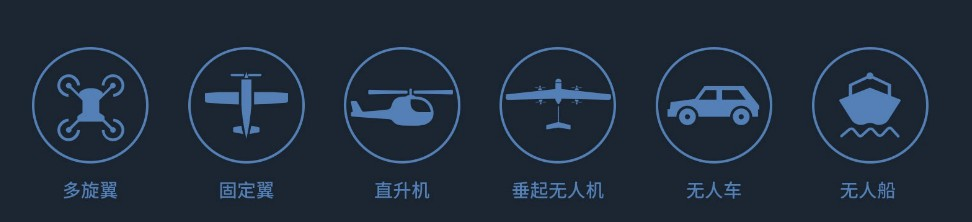

# DrjLab NextPilot

[DrjLab NextPilot](https://drjlab.taobao.com)是由DrjLab团队，基于[PX4FMU-V5](https://github.com/px4)开源硬件全新打造的高性能**飞行控制系统**。相对PX4FMU-V3采用更加先进的处理器、拥有更大的flash及RAM、更稳定可靠的传感器。

DrjLab NextPilot提供全新的无人机系统解决方案，可集成厘米级精度的RTK模块、智能电调和高清图传。开发者可使用[DroneCode](https://www.dronecode.org)定制专属应用，实时获取飞行器状态信息，并且控制飞行器、 云台和相机。NextPilot配备CAN、API等丰富的硬件接口，可连接第三方传感器或其他设备，让你针对各种行业应用对飞行平台进行灵活定制。

- 采用第四代硬件构架，IO全隔离防水设计，航空铝材全金属外壳，具有极高的可靠性和卓越的飞行性能；
- 内置减震的三余度高性能IMU，支持RTK厘米级定位，基于第二代EKF融合算法，提供高精准导航信息；
- 提供多平台的SDK，支持用户打造个性化的无人机，满足专业用途定制的需求，挖掘无人机应用潜；
- 模块化防呆设计风格，配备CAN、API等丰富的硬件接口，可连接第三方传感器或其他设备。

## 技术参数
### 处 理 器
- 主处理器：STM32F765 (32 Bit Arm® Cortex®-M7, 216MHz, 2MB flash, 512KB RAM)
- 协处理器：STM32F100 (32 Bit Arm® Cortex®-M3, 24MHz, 8KB SRAM)

### 传 感 器
- 加速计：ICM-20602/ICM-20689/BMI055
- 陀螺仪：ICM-20602/ICM-20689/BMI055
- GPS定位：ublox Neo-M8N，带IST8310磁力计
- 磁罗盘：IST8310
- 气压计：MS5611

### 电气特性
- 功耗： ≤ 5W
- 工作电压： 4.9~5.5V
- USB供电：4.75~5.25V
- 伺服输入： 0~48V
- 支持双电源供电

### 环境要求
- 工作温度： -40~85 ℃
- 存储温度： -40~105 ℃
- 抗震等级： ≥ 5g
- 防水防尘： IP65 （IEC 60529）
- 电磁干扰： EMC

### 外形尺寸
部件|尺寸|重量
:--:|:--:|:--:
FMU|57.9mm x 39mm x 17mm|46g
PMU|40mm x 28.2mm x 11.2mm|36g
GPS|D50mm x 12.2mm|32g
LED|25mm x 25mm x 6.3mm|13g

## 支持机型

PX4FMU支持多旋翼、固定翼、直升机、无人车、无人船等众多无人驾驶设备，[具体请参考这里](http://docs.px4.io/en/airframes/airframe_reference.html)。
- 固定翼：常规形式、飞翼形式
- 直升机：常规直升机、共轴双桨直升机
- 多旋翼：三轴、四轴、六轴、八轴多旋翼等
- 垂起机：标准形式、尾坐形式、倾转形式

## 硬件连接

## 接口说明
DrjLab Nextpilot包含以下接口，具体定义如下
|串口|数量|定义|
|:--:|:--:|:--:|
|串口|5|UART1=GPS,UART2=TEL1,UART3=TEL2,UART4=TLE3|
|遥控器|2|SBUS/PPM/SRM|
|PWM输出|8
|PWM输入|

!//[DrjLab NextPilot](assets/fmu-dev-pinouts.jpg)

## 地 面 站
用户可以使用QGroundControl（[点击下载](https://s3-us-west-2.amazonaws.com/qgroundcontrol/latest/QGroundControl-installer.exe)）进行飞控设置和飞行。
1. 下载并安装最新版QGroundControl
1. 用USB连接飞控和电脑，QGC能够自动识别PX4

## 用户指南
- 用户指南：https://docs.px4.io/en
- 开发指南：https://dev.px4.io/en
- 地 面 站：https://docs.qgroundcontrol.com/en
- 飞行模式：http://docs.px4.io/en/flight_modes
- 支持机型：http://docs.px4.io/en/airframes/airframe_reference.html
- 日志分析：http://docs.px4.io/en/log/flight_log_analysis.html

## 常见问题

1. 外置磁罗盘推荐安装在什么问题？
尽量远离机身、电机等金属、强磁类物质。安装时与机架保持水平，必须朝向机头。

1. LED不同颜色表示什么意义？